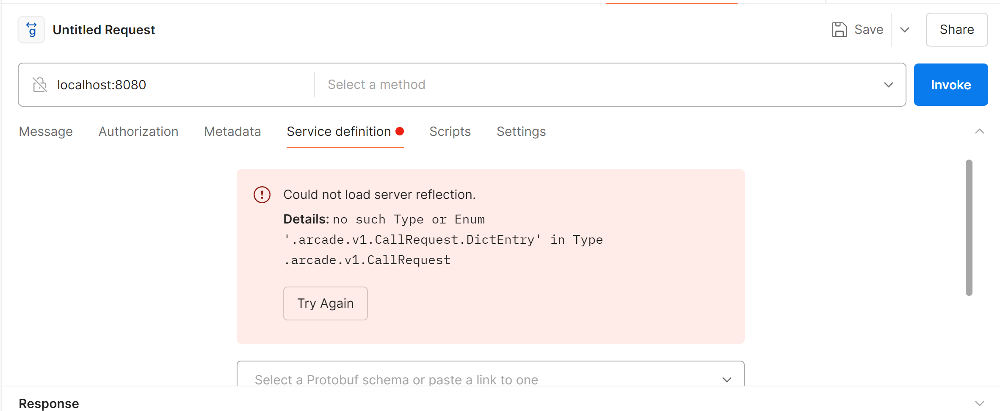

Update: the issue has been solved https://github.com/postmanlabs/postman-app-support/issues/12997

Steps to reproduce the bug

Install make and protobuf-compiler
```bash
sudo apt update
sudo apt install make
sudo apt install protobuf-compiler=3.21.12-8.2build1
````

Check installed version via
`protoc --version`
I've reproduced the bug with `libprotoc 3.21.12` on `Ubuntu 24.04`. It runs `WSL2` in Windows 11

The example compiles a protobuf and runs a non-TLS grpc server on port `8080`
If you want to change the port you can override it via env `export GRPC_PORT=<your-port>`

You can build and run the server app via make command
```bash
export GRPC_PORT=8080
make
```

I'm using Postman v11.3.1 (Windows 11) to check the issue

